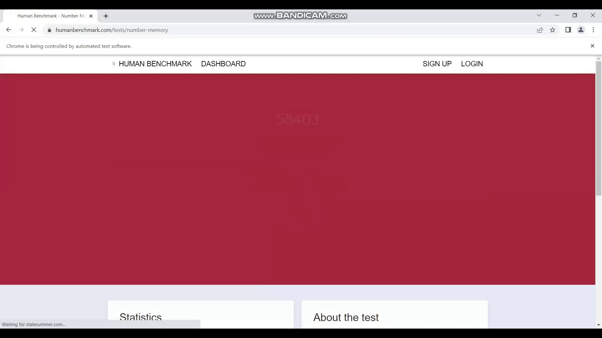
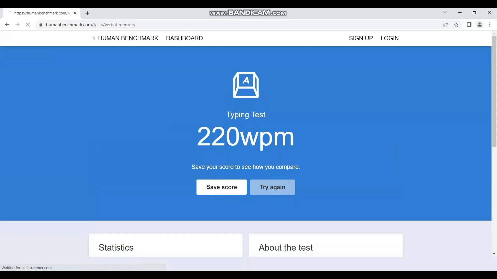
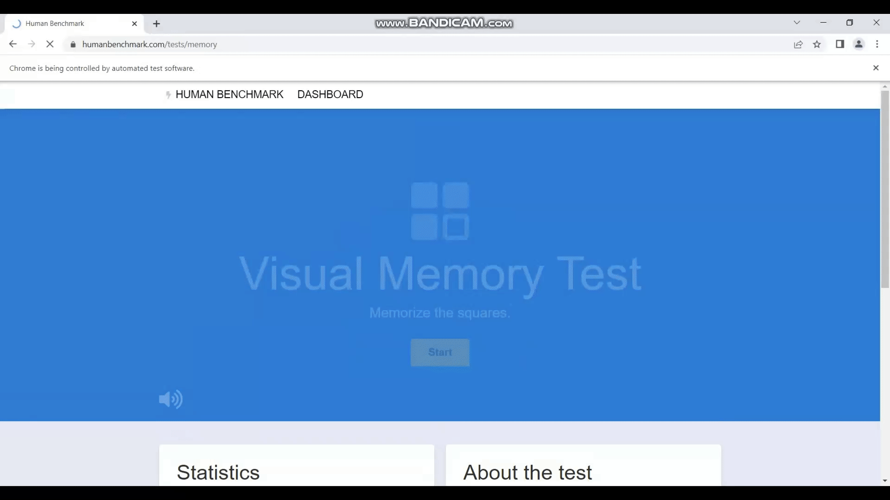

# Inhuman Benchmark Test

A web automation bot made with Selenium in Python to beat the [Human Benchmark Test](https://humanbenchmark.com/).

## Instructions

### I. Prerequisites

Enter the following in a CLI to install neccessary modules:

    pip install -r requirements.txt

### II. Running the Program

1.  Open the project folder in any CLI of your choice

2.  Run all tests one-by-one to get a quick demo of the bot:

        python main.py

3.  You can also run the tests individually by specifying the file's path, for example, the following code runs the [Aim Trainer](https://humanbenchmark.com/tests/aim) test:

        python scripts/aim_trainer.py

### III. Editing Level Limits

Inside the `__init__.py` file located under the `scripts/` folder, you will find two dictionary constants called `FAST` and `BEST`. Their dictionary values contain the level where you want to a particular test to end at. These limits exist for the endless/time-consuming tests.

- `FAST` the is default setting to run the all of the tests for a quick demo (this takes around 2 minutes).

- `BEST` is the setting to get the best possible score across the entire database of the website (Running `main.py` with this setting isn't recommended, as it takes a very long time).

You can manipulate the values of either constant and of any module to run the bot at whatever pace you like.

### IV. Avoiding Errors

To avoid any errors where the bot randomly stops running and to maximize its performance, it is best to run the program on it's own without minimizing the browser window or using any other applications in the background, especially ones that access the internet and consume a lot of the speed (like video calling).

## Demonstrations

